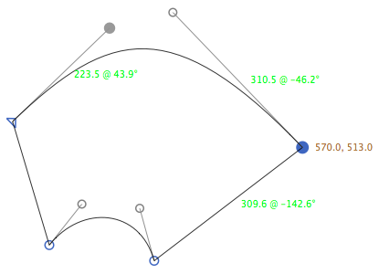

# ShowCoordinatesOfSelectedNodes.glyphsReporter

This is a plugin for the [Glyphs font editor](http://glyphsapp.com/).

It displays coordinates for selected on-curve nodes, as well as length and angle of the surrounding handles and line segments.

After installation, it will add the menu item *View > Show Coordinates of Selected Nodes*.
You can set a keyboard shortcut in System Preferences.

### Options

Run this line in the Macro Window to disable display of node info:

    Glyphs.defaults["com.mekkablue.ShowCoordinatesOfSelectedNodes.showNodes"] = False

Run this line in the Macro Window to disable display of node info:

    Glyphs.defaults["com.mekkablue.ShowCoordinatesOfSelectedNodes.showHandles"] = False

To reset the prefs, run any or both of these lines in Macro Window:

    del Glyphs.defaults["com.mekkablue.ShowCoordinatesOfSelectedNodes.showNodes"]
    del Glyphs.defaults["com.mekkablue.ShowCoordinatesOfSelectedNodes.showHandles"]

### Installation

1. In *Window > Plugin Manager,* click on the *Install* button next to *Show Coordinates of Selected Nodes.*
2. Restart Glyphs.

### Usage Instructions

1. Open a glyph in Edit View.
2. Use *View > Show Coordinates of Selected Nodes* to toggle the display of coordinates for selected nodes.

### Requirements

The plugin needs Glyphs 2.4 or higher.

### License

Copyright 2014-2018 Rainer Erich Scheichelbauer (@mekkablue).
Based on sample code by Georg Seifert (@schriftgestalt) and Jan Gerner (@yanone).

Licensed under the Apache License, Version 2.0 (the "License");
you may not use this file except in compliance with the License.
You may obtain a copy of the License at

http://www.apache.org/licenses/LICENSE-2.0

See the License file included in this repository for further details.
